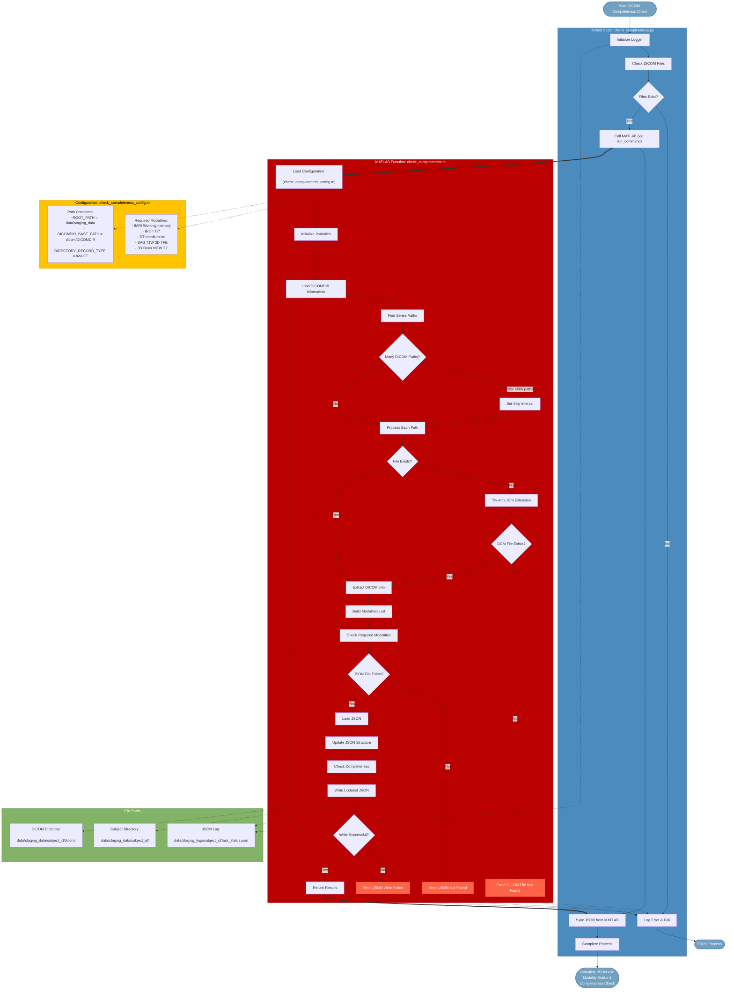

```mermaid
flowchart TB
    %% Main starting point
    start([Start DICOM Completeness Check]) --> py1
    
    %% Python process
    subgraph Python["Python Script: check_completeness.py"]
        py1[Initialize Logger] --> py2[Check DICOM Files]
        py2 --> pyDecision{Files Exist?}
        pyDecision -->|No| pyFail[Log Error & Fail]
        pyDecision -->|Yes| py3["Call MATLAB (via run_command)"]
        py3 --> py4[Sync JSON from MATLAB]
        py4 --> py5[Complete Process]
    end
    
    %% MATLAB process
    subgraph MATLAB["MATLAB Function: check_completeness.m"]
        m1["Load Configuration 
        (check_completeness_config.m)"] --> m2[Initialize Variables]
        m2 --> m3[Load DICOMDIR Information]
        m3 --> m4[Find Series Paths]
        
        %% Handling large number of paths
        m4 --> mPathCount{Many DICOM Paths?}
        mPathCount -->|Yes: >500 paths| mSetSpeed[Set Skip Interval]
        mPathCount -->|No| mProcess[Process Each Path]
        mSetSpeed --> mProcess
        
        mProcess --> mFileCheck{File Exists?}
        mFileCheck -->|No| mTryDCM[Try with .dcm Extension]
        mTryDCM --> mDCMCheck{DCM File Exists?}
        mDCMCheck -->|No| mFileError[Error: DICOM File Not Found]
        mFileCheck -->|Yes| mExtract[Extract DICOM Info]
        mDCMCheck -->|Yes| mExtract
        
        mExtract --> m5[Build Modalities List]
        m5 --> m6[Check Required Modalities]
        
        m6 --> mJsonCheck{JSON File Exists?}
        mJsonCheck -->|No| mJsonError[Error: JSON Not Found]
        mJsonCheck -->|Yes| m7[Load JSON]
        
        m7 --> m8[Update JSON Structure]
        m8 --> m9[Check Completeness]
        m9 --> mWriteJSON[Write Updated JSON]
        
        %% JSON Write error handling
        mWriteJSON --> mTryCatch{Write Successful?}
        mTryCatch -->|No| mWriteError[Error: JSON Write Failed]
        mTryCatch -->|Yes| mSuccess[Return Results]
    end
    
    %% Config details
    subgraph Config["Configuration: check_completeness_config.m"]
        c1[Required Modalities:
        - fMRI Working memory
        - Brain T2*
        - DTI medium iso
        - SAG T1W 3D TFE
        - 3D Brain VIEW T2]
        
        c2[Path Constants:
        - ROOT_PATH = data/staging_data
        - DICOMDIR_BASE_PATH = dicom/DICOMDIR
        - DIRECTORY_RECORD_TYPE = IMAGE]
    end
    
    %% Data paths
    subgraph DataPaths["File Paths"]
        d1[Subject Directory:
        data/staging_data/subject_id/]
        
        d2[DICOM Directory:
        data/staging_data/subject_id/dicom/]
        
        d3[JSON Log:
        data/staging_logs/subject_id/task_status.json]
    end
    
    %% Connections
    py3 ==> m1
    m1 -.-> c1
    m1 -.-> c2
    mSuccess ==> py4
    
    %% Data connections
    py1 -.-> d3
    m3 -.-> d1
    m3 -.-> d2
    mWriteJSON -.-> d3
    
    %% Error paths
    mFileError -.-> pyFail
    mJsonError -.-> pyFail
    mWriteError -.-> pyFail
    
    %% Output
    py5 --> output([Complete JSON with 
    Modality Status & 
    Completeness Check])
    
    pyFail --> fail([Failed Process])
    
    %% Styling
    classDef python fill:#4B8BBE,stroke:#306998,color:white,rounded;
    classDef matlab fill:#BB0000,stroke:#8B0000,color:white,rounded;
    classDef config fill:#FFC300,stroke:#DAA520,color:black,rounded;
    classDef data fill:#82B366,stroke:#5D8444,color:white,rounded;
    classDef endpoint fill:#72A0C1,stroke:#4682B4,color:white,rounded;
    classDef error fill:#FF6347,stroke:#8B0000,color:white,rounded;
    
    class Python python;
    class MATLAB matlab;
    class Config config;
    class DataPaths data;
    class start,output,fail endpoint;
    class mFileError,mJsonError,mWriteError error;
```
